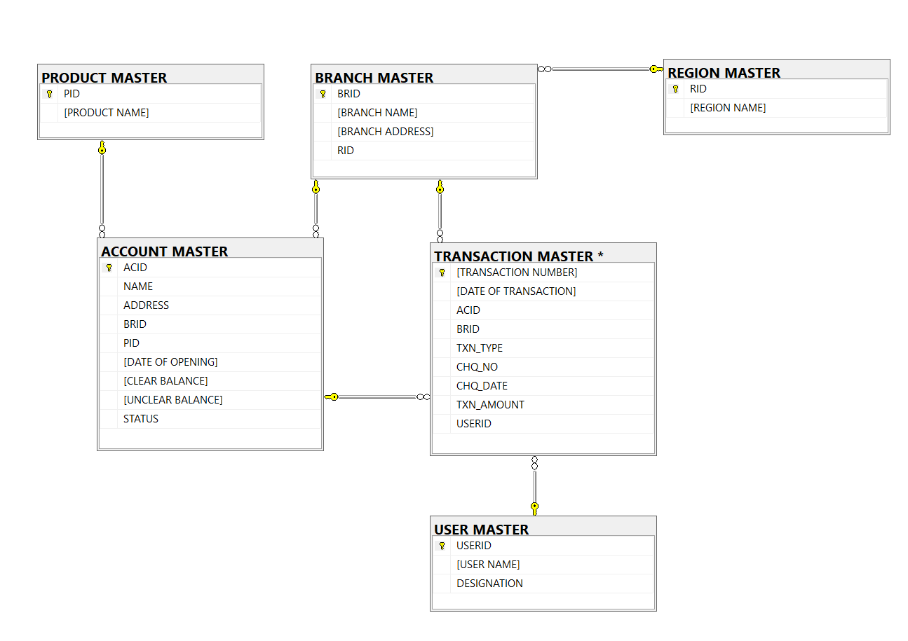

# 🔧 Technical Specifications - Indian Bank Database System

## Document Information
- **Project**: Indian Bank Database Management System
- **Version**: 1.0  
- **Technology Stack**: SQL Server 2019+
- **Architecture**: Relational Database Management System
- **Date**: November 2024

---

## 🏗️ System Architecture

### High-Level Architecture
```
┌─────────────────────────────────────────────────────────────────┐
│                    APPLICATION LAYER                            │
│  ┌──────────────┐ ┌──────────────┐ ┌──────────────┐            │
│  │    Web App   │ │    Desktop   │ │   Reports    │            │
│  │              │ │     App      │ │              │            │
│  └──────────────┘ └──────────────┘ └──────────────┘            │
└─────────────────────────────────────────────────────────────────┘
                               │
                               ▼
┌─────────────────────────────────────────────────────────────────┐
│                     DATA ACCESS LAYER                           │
│  ┌──────────────┐ ┌──────────────┐ ┌──────────────┐            │
│  │   Stored     │ │    Views     │ │  Functions   │            │
│  │ Procedures   │ │              │ │              │            │
│  └──────────────┘ └──────────────┘ └──────────────┘            │
└─────────────────────────────────────────────────────────────────┘
                               │
                               ▼
┌─────────────────────────────────────────────────────────────────┐
│                    DATABASE LAYER                               │
│  ┌──────────────┐ ┌──────────────┐ ┌──────────────┐            │
│  │    Tables    │ │   Triggers   │ │ Constraints  │            │
│  │              │ │              │ │              │            │
│  └──────────────┘ └──────────────┘ └──────────────┘            │
└─────────────────────────────────────────────────────────────────┘
```

### Technology Stack
- **Database Engine**: Microsoft SQL Server 2019 or higher
- **Development Tools**: SQL Server Management Studio (SSMS)
- **Version Control**: Git with GitHub repository
- **Documentation**: Markdown with GitHub Pages
- **Backup Solution**: SQL Server Native Backup with compression

---

## 🗂️ Database Design

### Entity Relationship Diagram



### Table Specifications

#### REGION MASTER
```sql
CREATE TABLE [REGION MASTER] (
    RID                 INTEGER         PRIMARY KEY,
    [REGION NAME]       CHAR(6)         NOT NULL
);
```
**Purpose**: Geographic region management for branch organization
**Indexes**: Clustered index on RID (Primary Key)
**Relationships**: One-to-Many with BRANCH MASTER

#### PRODUCT MASTER
```sql
CREATE TABLE [PRODUCT MASTER] (
    PID                 CHAR(2)         PRIMARY KEY,
    [PRODUCT NAME]      VARCHAR(25)     NOT NULL
);
```
**Purpose**: Banking product catalog (Savings, Current, FD, RD)
**Indexes**: Clustered index on PID (Primary Key)
**Business Rules**: Product cannot be deleted if accounts exist

#### BRANCH MASTER
```sql
CREATE TABLE [BRANCH MASTER] (
    BRID                CHAR(3)         PRIMARY KEY,
    [BRANCH NAME]       VARCHAR(30)     NOT NULL,
    [BRANCH ADDRESS]    VARCHAR(50)     NOT NULL,
    RID                 INT             NOT NULL FOREIGN KEY REFERENCES [REGION MASTER](RID)
);
```
**Purpose**: Bank branch information and regional association
**Indexes**: 
- Clustered: BRID (Primary Key)
- Non-clustered: RID (Foreign Key)

#### USER MASTER
```sql
CREATE TABLE [USER MASTER] (
    USERID              INTEGER         PRIMARY KEY,
    [USER NAME]         VARCHAR(30)     NOT NULL,
    DESIGNATION         CHAR(1)         NOT NULL CHECK (DESIGNATION IN ('M', 'T', 'C', 'O'))
);
```
**Purpose**: System user management with role-based access
**Roles**: M=Manager, T=Teller, C=Clerk, O=Officer
**Security**: Integrated with application-level authentication

#### ACCOUNT MASTER
```sql
CREATE TABLE [ACCOUNT MASTER] (
    ACID                INTEGER         PRIMARY KEY,
    NAME                VARCHAR(40)     NOT NULL,
    ADDRESS             VARCHAR(50)     NOT NULL,
    BRID                CHAR(3)         NOT NULL FOREIGN KEY REFERENCES [BRANCH MASTER](BRID),
    PID                 CHAR(2)         NOT NULL FOREIGN KEY REFERENCES [PRODUCT MASTER](PID),
    [DATE OF OPENING]   DATETIME        NOT NULL,
    [CLEAR BALANCE]     MONEY           NULL,
    [UNCLEAR BALANCE]   MONEY           NULL,
    STATUS              CHAR(1)         NOT NULL DEFAULT 'O' CHECK (STATUS IN ('O', 'I', 'C'))
);
```
**Purpose**: Core customer account information
**Indexes**:
- Clustered: ACID (Primary Key)  
- Non-clustered: BRID, PID, STATUS
- Covering: (STATUS) INCLUDE (CLEAR_BALANCE, UNCLEAR_BALANCE)

#### TRANSACTION MASTER
```sql
CREATE TABLE [TRANSACTION MASTER] (
    [TRANSACTION NUMBER]    INTEGER         IDENTITY(1,1) PRIMARY KEY,
    [DATE OF TRANSACTION]   DATETIME        NOT NULL,
    ACID                    INTEGER         NOT NULL FOREIGN KEY REFERENCES [ACCOUNT MASTER](ACID),
    BRID                    CHAR(3)         NOT NULL FOREIGN KEY REFERENCES [BRANCH MASTER](BRID),
    TXN_TYPE               CHAR(3)         NOT NULL CHECK (TXN_TYPE IN ('CW', 'CD', 'CQD')),
    CHQ_NO                 INTEGER         NULL,
    CHQ_DATE               SMALLDATETIME   NULL,
    TXN_AMOUNT             MONEY           NOT NULL,
    USERID                 INTEGER         NOT NULL FOREIGN KEY REFERENCES [USER MASTER](USERID)
);
```
**Purpose**: Transaction recording and audit trail
**Indexes**:
- Clustered: TRANSACTION NUMBER (Primary Key)
- Non-clustered: DATE_OF_TRANSACTION, ACID, TXN_AMOUNT
- Covering: (DATE_OF_TRANSACTION, TXN_TYPE) INCLUDE (ACID, TXN_AMOUNT)

---

## ⚙️ Business Logic Implementation

### Triggers (Business Rule Enforcement)

#### 1. Date Validation Trigger
```sql
CREATE TRIGGER TRG_CHECK_CURRENT_DATES
ON [TRANSACTION MASTER]
INSTEAD OF INSERT
```
**Purpose**: Ensures all transactions use current date
**Logic**: Automatically sets DATE_OF_TRANSACTION to GETDATE()

#### 2. Account Status Validation
```sql  
CREATE TRIGGER TRG_CHECK_ACCOUNT_STATUS
ON [TRANSACTION MASTER]
FOR INSERT, UPDATE
```
**Purpose**: Prevents transactions on inactive/closed accounts
**Logic**: Validates account STATUS before allowing transactions

#### 3. Transaction Limits Enforcement
```sql
CREATE TRIGGER TRG_CHECK_DAILY_CW_LIMIT
ON [TRANSACTION MASTER]
FOR INSERT
```
**Purpose**: Enforces daily cash withdrawal limits (max 3 per day)
**Logic**: Counts existing transactions for current date

#### 4. Balance Update Automation
```sql
CREATE TRIGGER TRG_COMPREHENSIVE_TRANSACTION_RULES
ON [TRANSACTION MASTER]  
FOR INSERT
```
**Purpose**: Automatic balance updates and penalty calculations
**Logic**: 
- Updates CLEAR_BALANCE and UNCLEAR_BALANCE
- Applies penalties for limit violations
- Inserts high-value transactions into monitoring table

### Check Constraints

#### Data Integrity Constraints
```sql
-- Transaction amount validation
ALTER TABLE [TRANSACTION MASTER]
ADD CONSTRAINT CHK_TXN_AMOUNT_POSITIVE CHECK (TXN_AMOUNT > 0);

-- Cheque validation for deposits
ALTER TABLE [TRANSACTION MASTER]
ADD CONSTRAINT CHK_CHEQUE_DETAILS CHECK (
    (TXN_TYPE = 'CQD' AND CHQ_NO IS NOT NULL AND CHQ_DATE IS NOT NULL) OR
    (TXN_TYPE IN ('CW', 'CD'))
);

-- Balance relationship validation  
ALTER TABLE [ACCOUNT MASTER]
ADD CONSTRAINT CHK_UNCLEAR_BALANCE CHECK ([UNCLEAR BALANCE] >= [CLEAR BALANCE] OR [UNCLEAR BALANCE] IS NULL OR [CLEAR BALANCE] IS NULL);
```

---

## 📊 Views & Reporting Layer

### Business Intelligence Views

#### Customer Analytics View
```sql
CREATE VIEW VW_CUSTOMER_TRANSACTION_SUMMARY AS
SELECT 
    am.ACID AS [Account Number],
    am.NAME,
    MAX(tm.[DATE OF TRANSACTION]) AS [Date of Last Transaction],
    COUNT(tm.[TRANSACTION NUMBER]) AS [Total Number of Transactions]
FROM [ACCOUNT MASTER] am
LEFT JOIN [TRANSACTION MASTER] tm ON am.ACID = tm.ACID
GROUP BY am.ACID, am.NAME;
```

#### Branch Performance View
```sql
CREATE VIEW VW_BRANCH_PRODUCT_UNCLEARED_BALANCE AS
SELECT 
    bm.BRID AS [Branch ID],
    bm.[BRANCH NAME],
    pm.PID AS [Product ID], 
    pm.[PRODUCT NAME],
    SUM(ISNULL(am.[UNCLEAR BALANCE], 0)) AS [Sum of Uncleared Balance]
FROM [ACCOUNT MASTER] am
INNER JOIN [BRANCH MASTER] bm ON am.BRID = bm.BRID
INNER JOIN [PRODUCT MASTER] pm ON am.PID = pm.PID
GROUP BY bm.BRID, bm.[BRANCH NAME], pm.PID, pm.[PRODUCT NAME];
```

---

## 🔧 Performance Optimization

### Indexing Strategy

#### Primary Indexes (Automatically Created)
- All PRIMARY KEY constraints create clustered indexes
- IDENTITY columns optimized for sequential inserts

#### Secondary Indexes (Performance Optimization)
```sql
-- Transaction date and amount for reporting queries
CREATE INDEX IX_Transaction_Date_Amount 
ON [TRANSACTION MASTER] ([DATE OF TRANSACTION], TXN_AMOUNT);

-- Account balance for quick balance lookups
CREATE INDEX IX_Account_Balance 
ON [ACCOUNT MASTER] ([CLEAR BALANCE]) 
WHERE [CLEAR BALANCE] IS NOT NULL;

-- Account status for active account queries
CREATE INDEX IX_Account_Status 
ON [ACCOUNT MASTER] (STATUS) 
INCLUDE ([CLEAR BALANCE], [UNCLEAR BALANCE]);
```

#### Covering Indexes (Query Optimization)
```sql
-- Customer transaction analysis
CREATE INDEX IX_Account_Transaction_Summary
ON [TRANSACTION MASTER] (ACID, [DATE OF TRANSACTION])
INCLUDE (TXN_TYPE, TXN_AMOUNT);
```

### Query Optimization Guidelines

#### Efficient Query Patterns
```sql
-- Good: Uses index on DATE_OF_TRANSACTION
SELECT * FROM [TRANSACTION MASTER] 
WHERE [DATE OF TRANSACTION] >= '2024-01-01'
AND [DATE OF TRANSACTION] < '2024-02-01';

-- Avoid: Function on indexed column
-- SELECT * FROM [TRANSACTION MASTER] 
-- WHERE YEAR([DATE OF TRANSACTION]) = 2024;
```

#### Pagination for Large Result Sets
```sql
-- Efficient pagination using OFFSET/FETCH
SELECT * FROM [TRANSACTION MASTER]
ORDER BY [TRANSACTION NUMBER]
OFFSET 1000 ROWS FETCH NEXT 100 ROWS ONLY;
```

---

## 🔐 Security Implementation

### Authentication & Authorization

#### Role-Based Security Model
```sql
-- Create database roles
CREATE ROLE BankManager;
CREATE ROLE BankTeller;  
CREATE ROLE BankClerk;
CREATE ROLE BankOfficer;

-- Grant permissions by role
GRANT SELECT, INSERT, UPDATE ON [ACCOUNT MASTER] TO BankManager;
GRANT SELECT, INSERT ON [TRANSACTION MASTER] TO BankTeller;
GRANT SELECT ON [ACCOUNT MASTER] TO BankClerk;
```

#### Data Access Controls
```sql
-- Row-level security example (future enhancement)
CREATE SECURITY POLICY AccountAccessPolicy
ADD FILTER PREDICATE security.fn_securitypredicate(BRID) 
ON [ACCOUNT MASTER];
```

### Data Protection

#### Sensitive Data Handling
- **Personal Information**: Customer names and addresses
- **Financial Data**: Account balances and transaction amounts  
- **Audit Data**: User actions and timestamps

#### Encryption Strategy
```sql
-- Column-level encryption for sensitive data
ALTER TABLE [ACCOUNT MASTER]
ADD [ENCRYPTED_SSN] VARBINARY(256);

-- Transparent Data Encryption (TDE) at database level
ALTER DATABASE [INDIAN BANK] SET ENCRYPTION ON;
```

---

## 📈 Monitoring & Maintenance

### Performance Monitoring

#### Key Performance Indicators
```sql
-- Query to monitor system performance
SELECT 
    COUNT(*) as daily_transactions,
    AVG(DATEDIFF(millisecond, create_time, last_execution_time)) as avg_response_time
FROM sys.dm_exec_query_stats qs
CROSS APPLY sys.dm_exec_sql_text(qs.sql_handle) st
WHERE st.text LIKE '%TRANSACTION MASTER%'
AND qs.last_execution_time >= CAST(GETDATE() AS DATE);
```

#### Resource Utilization Monitoring
- **CPU Usage**: Target <70% average during peak hours
- **Memory Usage**: Monitor buffer pool hit ratio >95%
- **Disk I/O**: Track average disk response time <10ms
- **Connection Pool**: Monitor active connections and wait times

### Database Maintenance

#### Backup Strategy
```sql
-- Full backup daily
BACKUP DATABASE [INDIAN BANK] 
TO DISK = 'C:\Backup\IndianBank_Full.bak'
WITH FORMAT, COMPRESSION, CHECKSUM;

-- Transaction log backup every 15 minutes
BACKUP LOG [INDIAN BANK]
TO DISK = 'C:\Backup\IndianBank_Log.trn'
WITH COMPRESSION;
```

#### Index Maintenance
```sql
-- Weekly index maintenance
ALTER INDEX ALL ON [TRANSACTION MASTER] REBUILD
WITH (FILLFACTOR = 90, ONLINE = ON);

-- Update statistics weekly
UPDATE STATISTICS [ACCOUNT MASTER] WITH FULLSCAN;
```

#### Data Archival Strategy
- **Active Data**: Current year transactions (high-performance storage)
- **Recent Archive**: Previous 2 years (standard storage)
- **Historical Archive**: >3 years old (cold storage with compression)

---

## 🚀 Scalability & Future Enhancements

### Horizontal Scaling Options
- **Read Replicas**: For reporting and analytics queries
- **Partitioning**: Transaction table partitioning by date
- **Sharding**: Account-based sharding for very large implementations

### Vertical Scaling Considerations
- **Memory**: 32GB+ RAM for optimal buffer pool performance
- **Storage**: SSD storage for transaction logs and tempdb
- **CPU**: Multi-core processors for parallel query processing

### Integration Points
- **REST API**: Future web service layer
- **Message Queues**: Asynchronous processing for batch operations
- **ETL Processes**: Data warehouse integration
- **External Systems**: Core banking system integration

---

## 🧪 Testing Strategy

### Unit Testing
```sql
-- Example: Test business rule enforcement
-- Verify that inactive accounts reject transactions
BEGIN TRANSACTION;
    UPDATE [ACCOUNT MASTER] SET STATUS = 'I' WHERE ACID = 1001;
    
    -- This should fail
    INSERT INTO [TRANSACTION MASTER] 
    VALUES (GETDATE(), 1001, 'BR1', 'CW', NULL, NULL, 1000, 102);
ROLLBACK TRANSACTION;
```

### Performance Testing
- **Load Testing**: 1000+ concurrent transactions
- **Stress Testing**: Peak load simulation (Black Friday scenarios)
- **Volume Testing**: Large dataset performance (1M+ transactions)

### Security Testing
- **Penetration Testing**: SQL injection vulnerability assessment
- **Access Control Testing**: Role-based permission validation
- **Data Integrity Testing**: Constraint and trigger validation

---

## 📋 Deployment Specifications

### System Requirements

#### Minimum Hardware Requirements
- **CPU**: 4 cores, 2.5GHz
- **RAM**: 16GB
- **Storage**: 500GB SSD
- **Network**: Gigabit Ethernet

#### Recommended Production Requirements  
- **CPU**: 8+ cores, 3.0GHz
- **RAM**: 64GB+
- **Storage**: 2TB+ SSD with RAID 10
- **Network**: 10Gb Ethernet with redundancy

#### Software Requirements
- **Operating System**: Windows Server 2019 or later
- **Database**: SQL Server 2019 Standard/Enterprise
- **Security**: Windows Authentication integration
- **Backup**: SQL Server Agent for automated jobs

### Deployment Process
1. **Pre-deployment**: Environment preparation and validation
2. **Database Creation**: Execute creation scripts in sequence
3. **Data Migration**: Import existing data if applicable
4. **Testing**: Comprehensive system testing
5. **Go-Live**: Cutover with rollback plan
6. **Post-deployment**: Monitoring and optimization

---

*This Technical Specification document provides comprehensive implementation guidance for the Indian Bank Database System, ensuring robust, scalable, and maintainable database solution.*
```

